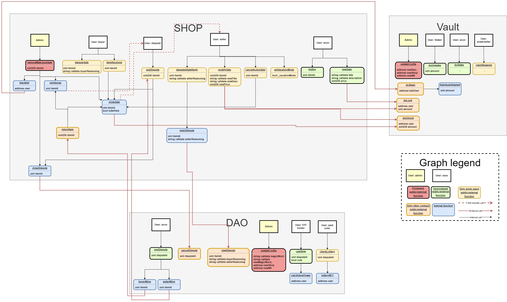

> [!WARNING]
> The code has been made vulnerable on purpose. Please do not deploy or reuse this codebase in a live environment.

---

# Mock audit exercise!

I sometimes feel that the jump between being able to identify issues in small snippets of code and auditting a more complex codebase is problematic. There are a loooot of small CTF like exercises, some easy some really difficult, but feel like there is a lack of a "mock audit contract" for people to practice their skills in a closer to real life project. 

So I decided to create the Faillapop protocol!

## The Faillapop protocol

The Faillapop protocol is a vulnerable-by-design protocol to help Web3 security students to practice their skills in a fun environment. The protocol is composed of multiple contracts that interact between each other to create a decentralize buying and selling platform. Disputes are resolved through a DAO and malicious sellers are checked by forcing a deposit before selling anything... but there have been a lot of bad decision during this process :mag:. 

You will find common solidity security issues, dubious centralization and logical loopholes. Do not forget to think about others such as flash loans and Out-Of-Gas exceptions! 

Try to perform a full mock-audit! Create your own professional report mimicking those of wellknown companies such as Oak Security, Trail of Bits, Hacken or Halborn. Imagine that you are getting paid for this and try to do the best job possible! not just finding bugs but also crafting proper paragraphs for your report. 

Solutions are not provided along this repo but documentation has been created following the NatSpec format and the following diagram will help you get the grasp of the whole architecture.

> [!TIP]
> Do not forget to run and analyze the testing suite. Sometimes you can spot vulnerabilities just by checking the bits that were neglected during testing and ensuring they behave as expected.

## Next steps

The current version is `v0.8`. At the moment I would like to achieve the below in order to upgrade it:

:pushpin:`V1.0`

- Add secret voting
- Add NFT contract, cool NFTs will boost voting power
- Populate template ERC20

:pushpin:`V2.0`

- Oracle
- Flash loan provider
- Make Shop upgradable
- Add more complex issues (several steps, X-contract reentrancy, etc.)
- Add further deviations from the doc/diagrams
